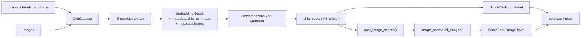

# Object detection OOD plan

Living plan for adding object-detection domain support to OODKit. This document captures scoped decisions, phases, and open questions so implementation can happen in clear chunks. When items ship, update `ROADMAP.md` per the workspace sync rules.

---

## 1. Goals

- Let users run OODKit detectors on object-detection-style inputs where the unit of interest is a **box** (chip) inside an image, and still reuse:
  - `Embedder` (backbone + optional head)
  - existing detectors (`ViM`, `MSP`, `Energy`, `Mahalanobis`, `KNN`, `PCA`, `PCAFusion`, `WDiscOOD`)
  - `oodkit.evaluation` (`ScoreBank`, metrics, plots, compare).
- Produce both **chip-level** scores (native granularity) and **image-level** scores (pooled), with simple pooling strategies in MVP.
- Ship a COCO / COCO-O demo notebook analogous to `notebooks/imagenet_ood_showcase.py`.

Non-goals for MVP:
- Training object detectors themselves; oodkit stays feature/score-centric.
- Advanced geometry- or context-aware pooling (deferred to the research section at the end).

---

## 2. Key design decisions

### 2.1 Bounding box coordinate convention

**Decision: canonical internal format is `xyxy` in pixel coordinates (float), matching `torchvision.ops`.**

- Accept other formats at the boundary via a tiny helper (e.g. `to_xyxy(boxes, fmt)` where `fmt in {"xyxy", "xywh", "cxcywh"}`, default `"xyxy"`).
- COCO annotations are `xywh`; we convert once at ingestion (`oodkit.contrib.coco`).
- Rationale: `xyxy` composes cleanly with clipping, min-size filters, and crop slicing; matches most PyTorch ecosystem code.

Document the convention in:
- `oodkit.data` (or wherever box utils live; see 2.2)
- COCO contrib helpers
- the object-detection section of the demo notebook

### 2.2 Where chipping lives

Two axes of choice:

**A. Eager chipping (precompute crops to disk) vs. lazy (`Dataset` that crops on `__getitem__`).**  
**B. Functional helper (`chip_image(image, boxes, ...)`) vs. `Dataset` class.**

**Decision: ship both, layered.**

- **Core utility:** `oodkit.data.chips` (new module, pure NumPy — no torch, no PIL) with:
  - `to_xyxy(boxes, fmt) -> np.ndarray`
  - `filter_small_boxes(boxes_xyxy, min_side) -> (boxes, kept_idx)` — optional size filter; callers apply it before chipping if they want to drop tiny annotations.
  - `square_chip_regions(boxes_xyxy, min_chip_size=25) -> np.ndarray (N, 4) int64` — pure geometry, returns the integer xyxy of the square chip region for each box (may extend past image edges).
  - `crop_chip(image, box_xyxy, min_chip_size=25, fill=0) -> np.ndarray` and batch variant `crop_chips(...)`. Operates on NumPy image arrays of shape `(H, W)` or `(H, W, C)`; out-of-bounds areas are zero-padded. Image decoding (PIL / torchvision) is handled one layer up in `ChipDataset`, so this module stays dependency-light.
- **`ChipDataset`** (lazy, torchvision-flavored; lives in `oodkit.data.chips` or `oodkit.embeddings.datasets`):
  - Inputs: a list/iterable of `(image_path_or_loader, boxes, per_box_metadata)`.
  - Yields `(chip_tensor, label_int)` for `Embedder.fit` / `Embedder.extract`.
  - Exposes `.chip_to_image: np.ndarray` (chip index → image index) and `.boxes: np.ndarray (N_chips, 4)` for downstream pooling.
- Eager chipping (writing a folder of crops and pointing `Embedder` at it) is supported implicitly — users can just pre-chip and use an ImageFolder — but we don’t add a dedicated tool for it in MVP. Leave that as a later nicety if users ask.

**Chipping rule (locked in):**
- Every chip is a **square**. Side length = `max(max(box_w, box_h), min_chip_size)` with default `min_chip_size=25`.
- Chip is centered on the box center; objects are never stretched or squeezed.
- If the square extends past the image edge, the out-of-bounds area is **zero-padded** at crop time. No letterbox / resize / stretch modes.
- Any per-backbone resizing (e.g. to 224×224) happens afterward in the preprocessor/transform, not in `crop_chip`.

### 2.3 Image-level pooling from chip scores

**Decision: MVP ships `mean`, `max`, and `topk_mean` pooling, implemented as pure functions over `(chip_scores, chip_to_image)`.**

API sketch (new module, e.g. `oodkit.evaluation.pooling`):

```python
def pool_image_scores(
    chip_scores: np.ndarray,       # (N_chips,)
    chip_to_image: np.ndarray,     # (N_chips,) int, values in [0, N_images)
    method: str = "mean",          # "mean" | "max" | "topk_mean"
    k: int = 3,                    # used only when method="topk_mean"
) -> np.ndarray:                   # (N_images,)
    ...
```

Rationale:
- Keep it score-array level so it composes with any detector.
- Don’t bake pooling into detectors; detectors stay OD-agnostic.
- `topk_mean` is a minimal nod to the future research direction without committing to anything geometry-aware.

Edge cases to handle:
- Images with **zero chips** (no detections meeting `min_size`): return `np.nan` and document that metrics helpers drop NaN rows (or require user to pass a fallback strategy).

### 2.4 Carrying chip → image mapping through the pipeline

Today `EmbeddingResult` has: `embeddings`, `logits`, `labels`, `metadata: Dict`.

**Decision: store OD-specific info in `metadata` rather than adding top-level fields.**

Recommended keys (all optional, only populated by OD workflows):
- `metadata["chip_to_image"]: np.ndarray (N_chips,) int64`
- `metadata["boxes"]: np.ndarray (N_chips, 4) float64  # xyxy`
- `metadata["image_paths"]: list[str]` already exists and here refers to **image-level** paths (indexable by `chip_to_image`).
- `metadata["image_ids"]: list[str]` — stable per-chip image identifier. Defaults to `Path(image_path).stem` when the annotation does not supply one.
- `metadata["group"]: list[str]` — free-form tag (e.g. OOD domain name like `"cartoon"`). Propagated from `ChipDataset.groups` for per-domain slicing.
- `metadata["object_ids"]: list[str]` — stable per-chip id, format (underscored, parts omitted when absent):
  `{image_id}[_{class_name}][_{group}]_{order}`. `order` is the annotation-order ordinal within the same `(image, class)` bucket (or within the image when unlabeled). Example: first cat in image `00067` in the `cartoon` group → `"00067_cat_cartoon_0"`. Chip filenames when saved to disk follow `{object_id}.jpeg` / `.png`.

List-valued OD metadata (`image_ids`, `group`, `object_ids`) goes through the same list-concatenation merge path as `image_paths` in `concatenate_embedding_results`, with an all-or-none presence check so per-chip lookups always line up with `embeddings`.

Rationale:
- Avoids changing the `EmbeddingResult` dataclass / breaking existing detectors/tests.
- Lets `concatenate_embedding_results` keep working: list-valued metadata already concatenates; we just add a small branch for array-valued metadata (or require users to pass arrays via a new helper — see Phase 4).

### 2.5 Evaluation wiring

`ScoreBank` / `evaluate` are already shape-agnostic. Two supported modes:

- **Chip-level evaluation:** feed chip-level `ood_labels` and chip scores directly into `ScoreBank`. Useful when the benchmark treats each chip as an independent sample (e.g. COCO vs COCO-O at the object level).
- **Image-level evaluation:** pool chip scores to `(N_images,)` with `pool_image_scores`, and build image-level `ood_labels` (one per image). Use the same `ScoreBank` / `evaluate` path.

MVP ships both flows in the demo notebook; no new metrics code needed.

---

## 3. Data flow



Key properties:
- Chips are just samples; everything up to the detector is unchanged.
- The only new first-class concept is **pooling from chip scores to image scores**.
- Boxes/mapping travel via `EmbeddingResult.metadata` so no existing API changes.

---

## 4. Implementation phases

Each phase is intended to be one focused PR / chunk.

### Phase 1 — box utilities and chipping primitives (no torch, no PIL)

- New module `src/oodkit/data/chips.py`:
  - `to_xyxy`, `filter_small_boxes`, `square_chip_regions`, `crop_chip`, `crop_chips` (pure NumPy on `(H, W)` / `(H, W, C)` image arrays).
- Tests under `tests/pkg/data/test_chips.py`:
  - format conversions and invalid-format error, `filter_small_boxes` longest-side rule, `square_chip_regions` geometry (equal-side, rectangular, min-size promotion, out-of-bounds), and `crop_chip` interior + edge-clipped + grayscale + RGB cases.

### Phase 2 — `ChipDataset`

- New module `src/oodkit/data/chip_dataset.py` (separate from `chips.py` so the pure-NumPy utilities stay torch-free; module imports torch / torchvision at top and raises a clear `ImportError` if `oodkit[ml]` is missing, mirroring `contrib/imagenet/dataset.py`).
- Public surface:
  - `ChipImageAnn` dataclass with `image_path`, `boxes`, optional `labels` (per-image).
  - `ChipDataset(torch.utils.data.Dataset)` that flattens chips across images.
  - `make_chip_annotations(records)` helper that accepts dict-like records for ergonomic construction (e.g. from COCO in Phase 5).
- Yields `(chip_tensor, int_label)` when the dataset is labeled, and the tensor alone when unlabeled. Requires labels to be either all-present or all-absent; rejects mixed annotations.
- Exposes:
  - `chip_to_image: np.ndarray (N_chips,) int64`
  - `boxes: np.ndarray (N_chips, 4) float64` (canonical xyxy)
  - `labels: Optional[np.ndarray (N_chips,) int64]`
  - `image_paths: list[str]` (length = number of source images)
  - `imgs: list[(parent_path, label)]` per chip so `Embedder.extract`'s existing `imgs`-based path writes per-chip parent paths into `EmbeddingResult.metadata["image_paths"]` without needing Phase 3 changes.
- `__getitem__` decodes the parent image via `torchvision.datasets.folder.default_loader`, converts to `image_mode` (default `"RGB"`), applies `crop_chip` from `oodkit.data.chips` (longest-side square, `min_chip_size=25`, zero-padded edges), and hands the chip through the provided HF processor.
- Tests: `tests/pkg/data/test_chip_dataset.py` covers labeled + unlabeled flow, `chip_to_image` mapping, `box_format="xywh"` conversion, min-size promotion of the chip, label/box length mismatch and mixed-labels validation, and `sample_descriptor` shape.
- No `Embedder` changes yet — those land in Phase 3 (OD-aware metadata).

### Phase 3 — OD-aware `EmbeddingResult` metadata

- `Embedder._extract_chip_metadata(ds)` duck-types on `.chip_to_image` / `.boxes`, validates shapes/lengths, and returns dtype-normalized `int64` / `float64` arrays (or `None` for non-chip datasets).
- `Embedder.extract` (in-memory path) merges `metadata["chip_to_image"]` and `metadata["boxes"]` alongside the existing `metadata["image_paths"]` when the dataset is chip-shaped. No behavior change for non-chip datasets.
- `Embedder._extract_to_disk` additionally writes `chip_to_image.npy` and `boxes.npy` next to `manifest.json`, adds `has_chip_to_image` / `has_boxes` flags to the manifest, and returns the metadata arrays as memory-mapped `.npy` views (same pattern as embeddings / logits / labels).
- `oodkit.embeddings.storage.load_embeddings` reads the new `.npy` files when the manifest flags are set, respecting the existing `frac` / `seed` subsampling path.
- `concatenate_embedding_results` merges chip metadata with per-block offsets:
  - `chip_to_image` is concatenated with a running offset equal to `max(prev_chip_to_image) + 1` so image indices stay unique across blocks.
  - `boxes` is vertically concatenated.
  - All-or-none enforcement: if any block provides chip metadata, every block must; otherwise `ValueError`. Matches the existing labels/logits policy.
- Tests:
  - `tests/pkg/embeddings/test_embedder.py` covers `_extract_chip_metadata` (happy path, missing attrs, length mismatch, bad boxes shape).
  - `tests/pkg/embeddings/test_storage.py` (new) covers `load_embeddings` with and without chip metadata and with `frac < 1.0` subsampling.
  - `tests/pkg/evaluation/test_combine.py` covers the offset logic and the all-or-none rule.

### Phase 4 — image-level pooling

- New module `src/oodkit/evaluation/pooling.py` with:

  ```python
  def pool_image_scores(
      chip_scores: np.ndarray,      # (N_chips,)
      chip_to_image: np.ndarray,    # (N_chips,) int, values in [0, n_images)
      method: str = "mean",         # "mean" | "max" | "topk_mean"
      k: int = 3,
      n_images: Optional[int] = None,
  ) -> np.ndarray:                  # (n_images,) float64
  ```
  - ``mean`` / ``max`` are vectorized via ``np.add.reduceat`` / ``np.maximum.reduceat`` after a stable argsort on ``chip_to_image``.
  - ``topk_mean`` uses ``np.partition`` per image; if an image has fewer than ``k`` chips we take the mean of all of them (no padding).
  - Output length defaults to ``max(chip_to_image) + 1``. Callers can pass ``n_images`` to force a longer output (e.g. to keep image indices aligned with a parent `image_paths` list when some images were fully dropped by box-size filtering or `frac < 1.0` subsampling).
  - Images with zero chips yield ``NaN``. Callers must drop / impute NaN rows before feeding them into ``ScoreBank``.
- Re-exported from `oodkit.evaluation` alongside `concatenate_embedding_results`.
- Tests in `tests/pkg/evaluation/test_pooling.py` cover each method (incl. unordered `chip_to_image`), zero-chip-image NaN output, `n_images` override, empty-input edge cases, and validation errors (unknown method, length mismatch, negative indices, `k < 1`, `n_images` too small).

### Phase 5 — COCO ingestion (`oodkit.contrib.coco`)

Mirrors `oodkit.contrib.imagenet` style (pure-Python helpers importable without `torch`; the `ChipDataset` builders lazy-import torch). We parse COCO JSON directly, so there is **no `pycocotools` dependency**.

**Directory layouts assumed by the discovery helpers** (and documented in the module docstring):

- **COCO ID:**
  ```
  <root>/
    coco_annotations/
      instances_train2017.json
      instances_val2017.json
    coco_train/   # image files
    coco_val/     # image files
  ```
- **COCO-O (per-domain):**
  ```
  <ood_root>/
    cartoon/
      annotations/instances_val2017.json
      images/      # image files (renamed from val2017/)
    tattoo/...
    weather/...
  ```
  The per-domain `val2017/` directory was renamed to `images/` in this repo; the discovery helper defaults match that, and all knobs are overridable for non-standard layouts.

**Public surface:**

- `CocoCategoryTable` — contiguous `0..K-1` labels built from a COCO `categories` list (or JSON file). Used as the shared label space across ID and OOD splits so labels line up end-to-end.
- `load_coco(ann_path, image_root, *, group=None, category_table=None, include_empty_images=False, min_box_side=0.0) -> list[ChipImageAnn]` — pure NumPy, converts COCO `xywh` → canonical `xyxy` upfront, drops `iscrowd` annotations, and tags each annotation with `image_id = Path(file_name).stem` and the supplied `group` (propagated to `EmbeddingResult.metadata["group"]` / `object_ids`).
- `discover_coco_id(root, ...) -> CocoIdPaths` and `discover_coco_ood(root, *, only=None, ...)` — tiny path-resolvers that validate the expected layout and return `(ann, images)` pairs.
- `coco_chip_dataset(ann_path, image_root, processor, *, group=None, category_table=None, min_chip_size=25, min_box_side=0.0, ...) -> ChipDataset` — thin wrapper around `load_coco` + `ChipDataset`; populates `class_names` from the category table so `object_ids` are human-readable.
- `coco_id_chip_datasets(root, processor, ...) -> {"train": ..., "val": ...}` and `coco_ood_chip_datasets(ood_root, processor, *, category_table, only=None, ...) -> {domain: ChipDataset, ...}` — notebook-friendly one-liners that tag every OOD annotation with `group=<domain_name>`.

**Tests** (under `tests/pkg/contrib/coco/`, no `pycocotools` dependency):

- `test_category_table.py` — contiguous remap, JSON ingestion, duplicate-name + unknown-id errors.
- `test_loader.py` — basic parse, `group` tagging, `iscrowd` filtering, `include_empty_images`, `min_box_side`, shared-table mode, missing-file errors.
- `test_discovery.py` — happy path for ID + OOD layouts, missing-path errors, `only=` order preservation.
- `test_dataset.py` — end-to-end `ChipDataset` build with the COCO-style layout, verifying `class_names`, `groups`, `image_ids`, and `object_ids` match the `{image_id}_{class_name}_{group}_{order}` format.

Phase-5 side effects on the core library (already landed with the COCO module):

- `ChipImageAnn` gained `group: Optional[str]` and `image_id: Optional[str]`.
- `ChipDataset` now takes `class_names` and exposes `groups`, `image_ids`, `object_ids`, plus an all-or-none validator on `group`.
- `Embedder._extract_chip_metadata` forwards `object_ids` / `groups` / `image_ids` as Python lists (so list-merge concatenation keeps working), and `_extract_to_disk` serializes them as `object_ids.json` / `groups.json` / `image_ids.json` with matching manifest flags.
- `oodkit.embeddings.storage.load_embeddings` reads those JSON lists back into `metadata`, respecting `frac`-subsampling.
- `oodkit.evaluation.combine` extends its all-or-none policy to the new list keys so mixed blocks fail loudly.

### Phase 6 — demo notebook

- New file `notebooks/coco_ood_showcase.py` (Jupytext `# %%` style, matching the ImageNet demo), structured as:
  1. Markdown intro, data layout, gated-download notes.
  2. Paths / hyperparameters (`CHIP_MIN_SIZE`, `CONTEXT_RATIO`, `HEAD_EPOCHS`, etc.).
  3. Imports.
  4. Build `ChipDataset` from COCO train (ID) + COCO val (ID eval) + COCO-O (OOD).
  5. `Embedder.fit(mode="head")` on COCO-train chips.
  6. `extract` per split → `concatenate_embedding_results` → `to_features`.
  7. Fit detectors on ID train; score chips.
  8. **Chip-level evaluation:** `ScoreBank` + `evaluate` table + plots.
  9. **Image-level evaluation:** `pool_image_scores` (mean, max, topk_mean) → second `ScoreBank` + `evaluate` table + plots.
  10. Markdown interpretation + caveats (chips ≠ detections; GT boxes only in MVP).
- Update `notebooks/README.md` with a short section describing the COCO demo and required data.

### Phase 7 — docs / roadmap cleanup

- Add a short README bullet pointing at the COCO demo and the OD concepts doc (this file).
- Update `ROADMAP.md`:
  - Keep the current `Object detection` backlog line while phases are in progress.
  - Move to **Completed** once Phases 1–6 ship, with a one-line summary.
- Promote the context-aware pooling idea to its own `[research]` roadmap entry (see next section).

---

## 5. Assumed MVP scope (and what we explicitly defer)

In scope for MVP:
- Ground-truth boxes only (from COCO / COCO-O annotations).
- Single-image, single-scale crops; no test-time augmentation.
- Simple pooling (`mean`, `max`, `topk_mean`).

Deferred (not MVP):
- Detector-predicted boxes and confidence-weighted pooling.
- Multi-scale / multi-context crops.
- Streaming chip extraction for very large datasets (can reuse existing `save_to` memmaps; revisit if pain emerges).
- Caching / reuse of chip tensors across detectors beyond what `Embedder.extract` already gives us.

---

## 6. Future research direction (context-aware pooling)

Kept intentionally out of the MVP so the first version ships clean.

Rough thesis:
- In OD, an object can be OOD relative to its **scene**, not only in isolation. A cow on a beach may be in-distribution as a cow, but out-of-distribution as a beach scene.
- We want an image-level OOD score that accounts for:
  - each chip's OOD score
  - inter-chip geometry (positions, sizes, overlaps)
  - scene-level embedding context (e.g. whole-image CLS token)
  - possibly class-conditional priors learned on ID scenes

Possible directions once MVP lands:
- Add a second extraction pass (or reuse) producing a whole-image embedding alongside chip embeddings.
- Learn or define a pooling function `f(chip_scores, chip_boxes, image_embedding) -> image_score` with a small ID-calibrated head.
- Explore graph-based pooling over chips (nodes = chips, edges = spatial relations).
- Compare against the MVP baselines (`mean`, `max`, `topk_mean`) on COCO / COCO-O; this is where a paper angle would live.

Concrete next step when we come back to this: a short design doc + a small experiment harness that plugs into `pool_image_scores`’s signature so the MVP benchmark becomes a direct apples-to-apples comparison.

---

## 7. Open questions (to resolve before each phase)

- Do we want `ChipDataset` to *require* per-chip labels, or allow unlabeled (score-only, no head training)? MVP bias: **allow both**, but the COCO demo uses labeled chips so `mode="head"` works.
- Chip label space for COCO: use the 80-class COCO category ids directly, or remap to contiguous 0..K−1? Recommend remapping with a `SynsetTable`-style helper (`CocoCategoryTable`) to mirror the ImageNet contrib pattern.
- Square handling default (`"pad"` vs `"resize"`) — confirm with one real backbone run on a handful of boxes; pick whichever gives more stable cosine similarities on an ID batch.
- `pool_image_scores` NaN policy for zero-chip images: drop vs. treat as most-OOD vs. user-provided fallback. MVP default: drop, with a warning if the count is non-trivial.

These don’t block writing the plan, but each should be nailed down in its phase’s PR description.
